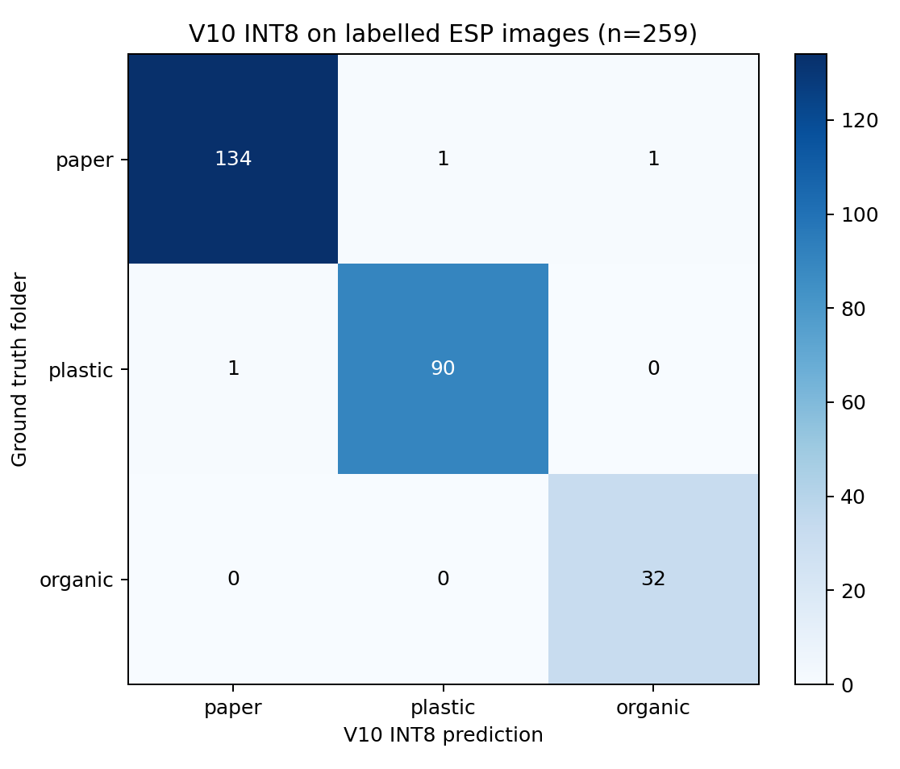
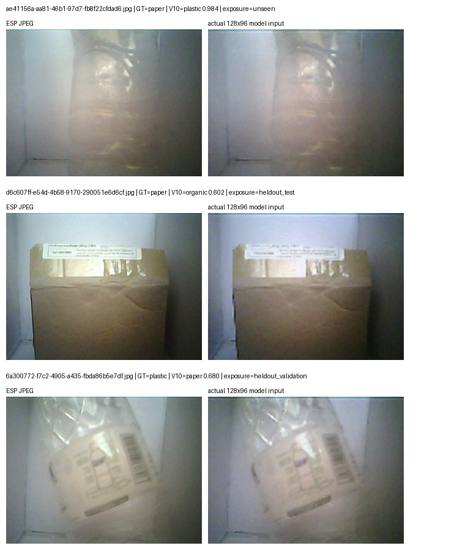
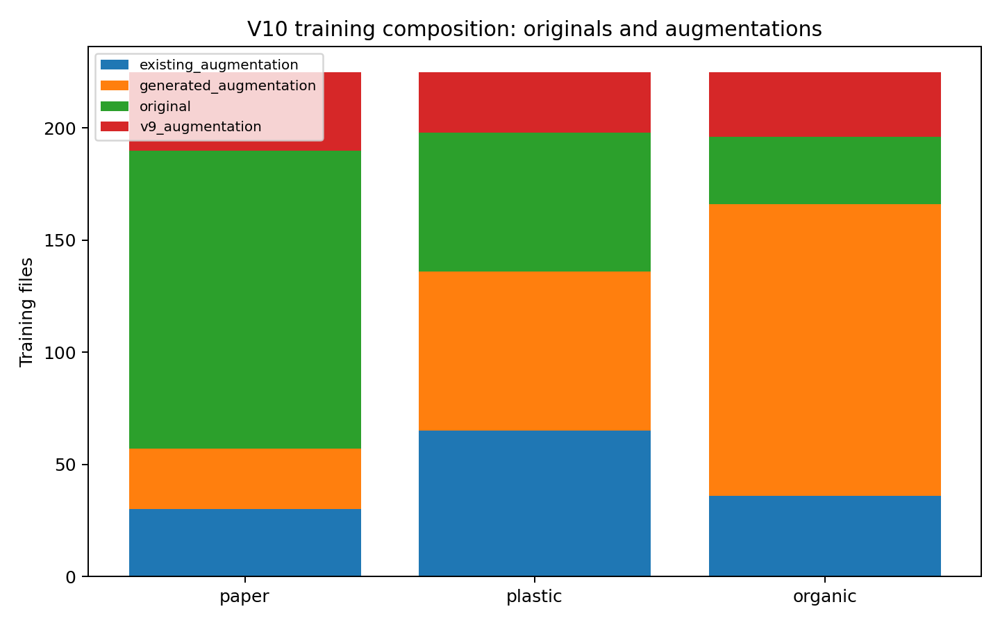
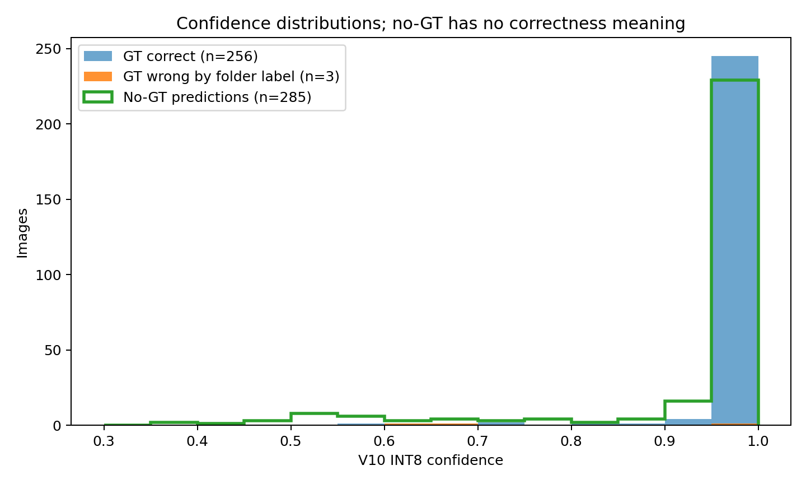
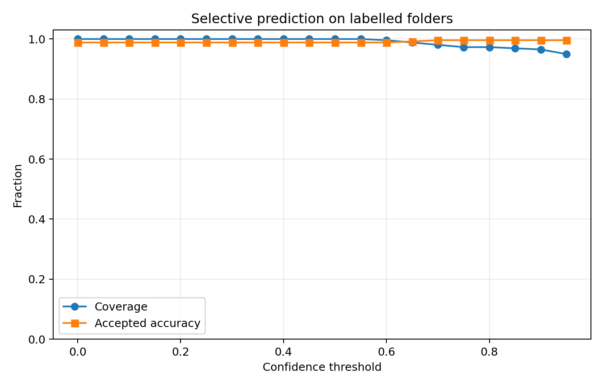
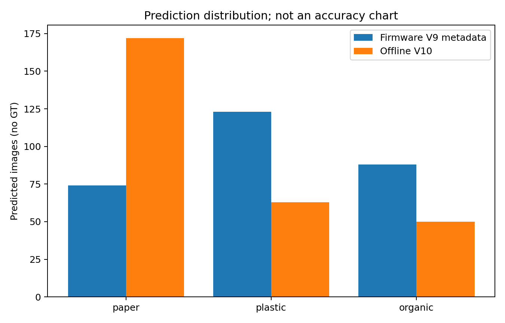
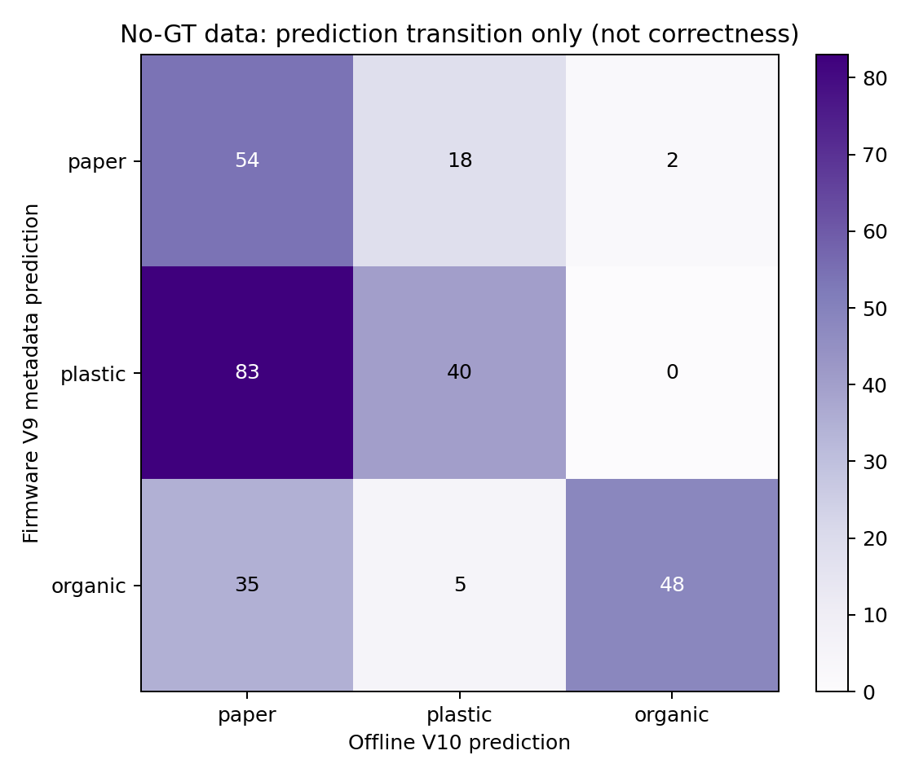
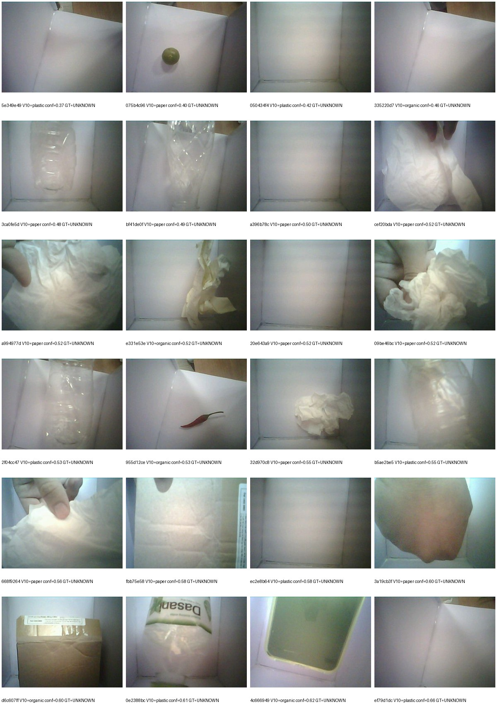
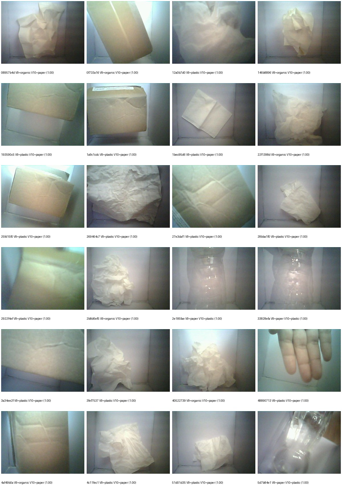
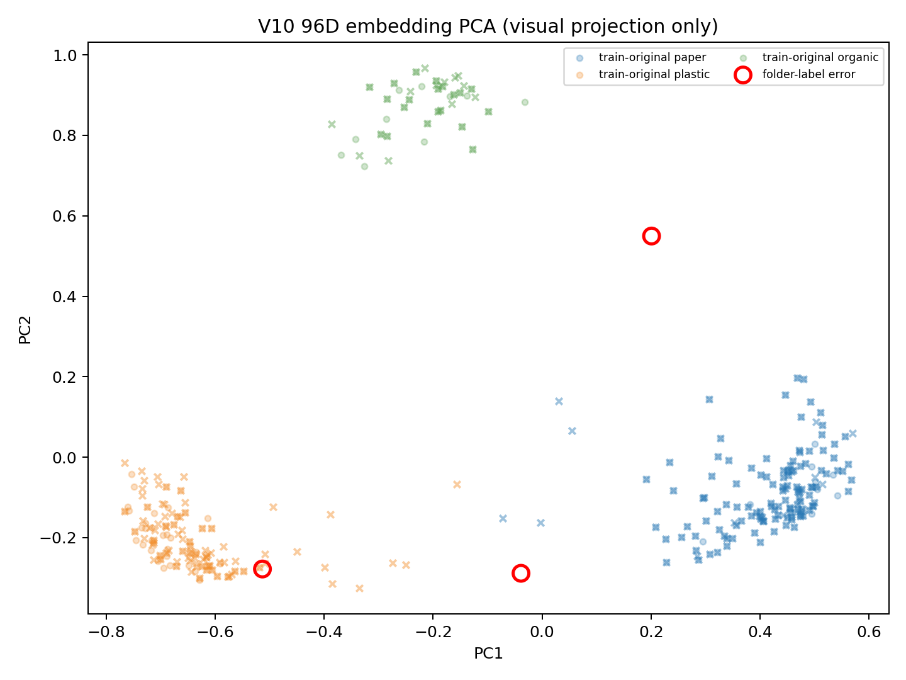

# Báo cáo phân tích V10 trên ảnh từ ESP32-CAM

Ngày tạo: 2026-08-14T03:51:29.805711+00:00

## Kết luận chính

V10 INT8 đạt **256/259 = 98.84%** trên ba
thư mục có ground truth `paper/plastic/organic`, macro-recall **99.14%**
và macro-F1 **0.988**. Theo nhãn thư mục có 3 lỗi, nhưng review trực
quan cho thấy một lỗi là ảnh chai nhựa rất có khả năng bị đặt nhầm trong `paper`.
Hai hard case còn lại là carton nâu bị đoán organic và nhựa trong có nhãn giấy lớn
bị đoán paper.

**Không tính accuracy cho `server-tmp/data/images`.** 285 ảnh
ở đó không có GT theo protocol của dự án. Báo cáo chỉ thống kê prediction, confidence,
drift và mức đồng thuận V9/V10; các dòng CSV đều ghi `correctness=NOT_EVALUATED`.

Ngoài ra, đây là chạy V10 **offline trên JPEG telemetry do ESP chụp**. Metadata của cả
285 ảnh vẫn là `tinycnn-v9-balanced-esp-contract`;
chưa phải bằng chứng V10 đã infer raw RGB565 trực tiếp trên board.

## 1. Protocol và kiểm kê dữ liệu

| Nhóm | Số ảnh | Có GT? | Cách dùng |
|---|---:|---|---|
| `server-tmp/paper` | 136 | Có | Accuracy/confusion/error analysis |
| `server-tmp/plastic` | 91 | Có | Accuracy/confusion/error analysis |
| `server-tmp/organic` | 32 | Có | Accuracy/confusion/error analysis |
| `server-tmp/data/images` | 285 | **Không** | Prediction/confidence/agreement only |

- Exact overlap giữa GT và no-GT: **209** ảnh.
- Chỉ có trong các thư mục GT: **50** ảnh.
- Chỉ có trong `data/images`: **76** ảnh.
- Exact duplicate nội bộ GT/no-GT: 0/
  0.

209 ảnh overlap vẫn được đánh giá từ bản nằm trong thư mục GT; bản `data/images`
không tự nhận GT. Quy tắc này tránh lỗi phương pháp từng coi prediction trên data là
đúng/sai dù chưa có nhãn.

## 2. Kết quả V10 trên ảnh có GT

| Model/chế độ | N | Accuracy | Macro recall | Min class recall |
|---|---:|---:|---:|---:|
| V9 INT8 local, crop 96x96 | 259 | 46.33% | 60.72% | 29.41% |
| V9 firmware metadata subset | 209 | 48.80% | 66.39% | 30.88% |
| V10 offline trên cùng subset | 209 | 98.56% | 98.70% | 97.56% |
| **V10 INT8 toàn bộ GT** | **259** | **98.84%** | **99.14%** | **98.53%** |

Hàng firmware V9 và V10 subset dùng cùng 209 ảnh có metadata, nhưng
không hoàn toàn cùng representation: firmware V9 infer framebuffer RGB565, V10 local
infer JPEG đã nén rồi mô phỏng RGB565 truncation.

| true \ predicted | paper | plastic | organic |
|---|---:|---:|---:|
| paper | 134 | 1 | 1 |
| plastic | 1 | 90 | 0 |
| organic | 0 | 0 | 32 |

## 3. Ba trường hợp khác nhãn GT

### `paper/ae41156a-aa81-46b1-97d7-fb8f22cfdad6.jpg`

- Folder GT: `paper`; V10: `plastic`; paper=0.016, plastic=0.984, organic=0.004.
- Exposure: `unseen`; nearest train: `train/plastic/augv9_plastic_train_original_005.jpg` (plastic, cosine 0.0233).
- Phân tích: Ảnh cho thấy chai/bao bì nhựa trong suốt. File đã bị audit loại khỏi dataset vì nghi gán nhãn paper sai; dự đoán plastic 98.44% phù hợp review trực quan.
### `paper/d6c607ff-e54d-4b58-9170-290051e6d6cf.jpg`

- Folder GT: `paper`; V10: `organic`; paper=0.395, plastic=0.004, organic=0.602.
- Exposure: `heldout_test`; nearest train: `train/organic/augv9_organic_train_original_014.jpg` (organic, cosine 0.1416).
- Phân tích: Thùng carton nâu chiếm gần toàn khung nhưng model nghiêng organic. Đây là lỗi model thật theo GT hiện tại; màu nâu/texture phẳng và ít biên phân biệt là hard case.
### `plastic/6a300772-f7c2-4905-a435-fbda86b5e7df.jpg`

- Folder GT: `plastic`; V10: `paper`; paper=0.680, plastic=0.320, organic=0.000.
- Exposure: `heldout_validation`; nearest train: `train/paper/augv9_paper_train_original_064.jpg` (paper, cosine 0.0645).
- Phân tích: Bao bì nhựa trong có nhãn giấy in lớn. Đây là vật liệu hỗn hợp về appearance; model bám vùng nhãn giấy và dự đoán paper.

Nếu sửa riêng ảnh nghi gán nhãn sai từ paper sang plastic, V10 sẽ đạt 257/259 =
99.23%. Con số này chỉ là sensitivity analysis, **không thay thế metric chính thức**
cho đến khi người phụ trách dữ liệu xác nhận nhãn.

## 4. Leakage và độ tin cậy của phép đo

GT exposure theo manifest V10:

- `exact_train_file`: **222**
- `heldout_validation`: **18**
- `heldout_test`: **18**
- `unseen`: **1**

222/259 ảnh GT là exact train file. Chỉ có một ảnh `unseen`, và đó chính là ảnh nghi
gán nhãn paper sai. Vì vậy 98.84% chủ yếu xác nhận model đã fit dữ liệu đã đưa vào
pipeline và preprocessing chạy nhất quán; nó **không đo generalization deployment**.

Train có 675 file: originals mỗi lớp
{'paper': 133, 'plastic': 62, 'organic': 30}, còn lại là augmentation đã lưu.
Số source-group train theo lớp là {'paper': 136, 'plastic': 67, 'organic': 30}.
Source-group hiện tách theo capture/file lineage, chưa bảo đảm tách theo vật thể vật lý
hoặc phiên chụp độc lập.

## 5. Confidence, calibration và reject threshold

- Mean confidence ảnh đúng: 0.986.
- Mean confidence ảnh khác GT: 0.755.
- NLL: 0.0395; Brier:
  0.0184; ECE 10-bin: 0.0093.
- Threshold 0.8 nhận 252/259 ảnh
  (97.30%) với accuracy 99.60%.

ECE và selective accuracy cũng bị lạc quan do train overlap. Không được chọn threshold
production từ tập này; cần calibration set độc lập. Ảnh nghi nhãn sai còn cho thấy
"high-confidence error" có thể là lỗi annotation chứ không phải lỗi model.

## 6. Phân tích 285 ảnh no-GT trong `data/images`

### Prediction distribution — không phải accuracy

| Nguồn prediction | paper | plastic | organic |
|---|---:|---:|---:|
| Firmware V9 metadata | 74 | 123 | 88 |
| Offline V10 | 172 | 63 | 50 |

V9 và V10 đồng ý top-1 trên **142/285 =
49.82%**. Không thể nói model nào đúng trên các ảnh
không có nhãn. Chuyển dịch lớn nhất là V9 plastic -> V10 paper (83) và
V9 organic -> V10 paper (35), phù hợp việc V10 đã được train lại bằng
nhiều ảnh carton/giấy trong chính miền ESP.

Confidence V10 trên no-GT: mean 0.938, median
0.996, minimum 0.371;
20 ảnh <0.6, 34 ảnh <0.8 và
245 ảnh >=0.9. Confidence cao không chứng minh đúng khi
không có GT.

10 prediction no-GT confidence thấp nhất:

| File | V10 prediction | V10 confidence | V9 prediction |
|---|---|---:|---|
| `5e349e49-7a01-4c6d-b027-0d815dfe4bae.jpg` | plastic | 0.371 | paper |
| `075b4c96-0e45-4fc1-85e8-b45f01322bc8.jpg` | paper | 0.398 | paper |
| `050434f4-7860-4fb8-b212-d0a83ad02480.jpg` | plastic | 0.418 | plastic |
| `335220d7-7950-4df8-b545-a307c2001f63.jpg` | organic | 0.465 | organic |
| `3ca0fe5d-41ee-40d3-8ac4-8ed10aba5178.jpg` | paper | 0.477 | plastic |
| `bf41de0f-b3fc-4fde-95fe-ab1c416d2b9c.jpg` | paper | 0.492 | paper |
| `a396b78c-dc8e-4ed1-a2af-1579291d8444.jpg` | paper | 0.500 | plastic |
| `cef20bda-780e-4761-a590-2c1228924cf2.jpg` | paper | 0.516 | paper |
| `20e643a9-367f-496d-8c05-098954b6ceb0.jpg` | paper | 0.520 | plastic |
| `a994977d-08fa-456c-8c1d-dd0e232c1235.jpg` | paper | 0.520 | paper |

10 bất đồng V9/V10 có confidence V10 cao nhất:

| File | V9 | V10 | V10 confidence |
|---|---|---|---:|
| `08957b4d-b996-4f82-a385-44b1c59b5c64.jpg` | organic | paper | 0.996 |
| `0f733a16-8745-4c19-9904-f0b5c31b91fa.jpg` | organic | paper | 0.996 |
| `12a0b7d0-7292-4b7d-bca0-ebefa53d7067.jpg` | plastic | paper | 0.996 |
| `146b8896-93fd-40bf-8163-c9112058ded4.jpg` | organic | paper | 0.996 |
| `193590c5-aa85-490c-8142-74db88c2a5c9.jpg` | plastic | paper | 0.996 |
| `1a9c1cdc-beaf-4a6a-b8bc-bc005188d77d.jpg` | plastic | paper | 0.996 |
| `1bec95d6-6a89-46a5-9314-b77b1f4575c5.jpg` | plastic | paper | 0.996 |
| `22f1398d-3ac0-43db-a55f-03defe8b04ab.jpg` | organic | paper | 0.996 |
| `25fd15f0-f9b1-405f-a2d4-ca23caccb2ed.jpg` | plastic | paper | 0.996 |
| `269464c7-a65a-46ca-b8e3-a97c1431b28a.jpg` | plastic | paper | 0.996 |

Review montage cho thấy nhiều frame no-GT là **thùng trống, tay người, vật chỉ lọt
một phần khung hoặc vật trắng/trong suốt rất ít texture**. Vì classifier chỉ có ba
lớp bắt buộc, nó vẫn phải trả `paper/plastic/organic` ngay cả khi không có vật hợp lệ.
Đáng chú ý, montage bất đồng có cả frame chủ yếu là bàn tay nhưng V10 vẫn trả `paper`
với confidence gần 1.0. Đây không được tính là prediction sai do chưa có GT, nhưng là
bằng chứng rõ rằng confidence hiện tại **không phải object-presence score** và model
thiếu lớp/gate `empty-background-invalid`.

Quan sát định tính cũng cho thấy nhiều chuyển dịch V9 -> V10 confidence cao là carton
hoặc giấy vò được V10 đưa về paper, còn một số chai trong được đưa về plastic. Pattern
này hợp lý về mặt thị giác nhưng vẫn cần gán nhãn để xác nhận. Trong 285 ảnh no-GT có
172 exact train file, 18 validation, 18 test và 77 unseen theo manifest; vì vậy ngay cả
phân bố confidence no-GT cũng chịu ảnh hưởng mạnh của dữ liệu đã thấy.

## 7. Embedding, coverage và giới hạn mô hình

Embedding dùng vector 96D sau global-average-pooling và 225
train-original reference. Có 19 ảnh GT ngoài
ngưỡng nearest-neighbor 95% của lớp thật, và 61
ảnh no-GT ngoài ngưỡng lớp dự đoán. Đây chỉ là diagnostic: exact train overlap tạo rất
nhiều khoảng cách bằng 0 và làm threshold thiên lệch.

V10 vẫn là whole-image classifier, không detect/segment vật thể. Nó có thể học nền,
màu, silhouette và nhãn in. Coverage organic hiện thiên về cucumber/lime/chili/small
fruit; chưa chứng minh tốt trên thức ăn thừa, vỏ bẩn, rau lá, đồ chín hoặc vật liệu hỗn
hợp. Nhựa trong có nhãn giấy và carton nâu là hai failure mode đã quan sát trực tiếp.

## 8. Kết luận kỹ thuật và hành động ưu tiên

1. **Giữ một phiên ESP mới hoàn toàn độc lập**: không đưa ảnh, frame gần kề hoặc
   augmentation lineage vào train; split theo vật thể vật lý + ngày chụp.
2. **Xác nhận lại nhãn** `paper/ae41156a-...jpg`. Nếu là chai nhựa, sửa GT và ghi
   audit trail; không âm thầm đổi để tăng metric.
3. **Gán nhãn 76 ảnh chỉ có trong `data/images`** trước khi dùng chúng để so accuracy.
   `no_gt_predictions.csv` là queue review, không phải bảng lỗi.
4. Bổ sung hard cases: carton nâu/ướt/bẩn; nhựa trong có label; bao bì composite;
   vật nhỏ/lệch mép; nền và ánh sáng mới; organic ngoài rau quả xanh.
5. Thêm trạng thái `unknown/retry`, nhưng chỉ calibrate threshold trên validation độc
   lập. Các ảnh <0.6 và bất đồng V9/V10 là ưu tiên review/active learning tốt.
6. Thêm **object-presence gate hoặc lớp `empty/background/invalid`** và hard negative
   gồm thùng trống, tay người, ảnh che camera, vật ngoài khung. Threshold softmax của
   classifier ba lớp không giải quyết được trường hợp không có vật.
7. Flash V10 lên board và thu phiên mới có metadata hash
   `ec212a03b00d38e2cfe1933309f49de4cfab67746a9d1c4116736abf82b01b13`. Đối chiếu raw-RGB565 firmware với offline JPEG
   để đo riêng sai khác codec/preprocessing.
8. Báo cáo production nên dùng macro recall, per-class recall, confusion, calibration
   và session-level bootstrap; không chỉ dùng accuracy file-level.

## 9. Artifact

- `gt_predictions.csv`: toàn bộ ảnh có GT và prediction V9/V10.
- `gt_misclassified.csv`: ba trường hợp khác folder label.
- `no_gt_predictions.csv`: prediction no-GT, mọi dòng ghi `NOT_EVALUATED`.
- `no_gt_low_confidence.csv`: queue review theo confidence.
- `no_gt_v9_v10_disagreements.csv`: queue review theo model disagreement.
- `summary.json`: toàn bộ số liệu máy đọc được.
- Các PNG/JPG: confusion, transition, confidence, threshold, PCA và montage.

## 10. Giới hạn diễn giải

- Folder name được coi là GT theo yêu cầu, nhưng báo cáo không tự xác minh mọi nhãn.
- V10 chạy local trên JPEG nén, không phải framebuffer RGB565 gốc.
- No-GT tuyệt đối không có accuracy/error rate trong báo cáo.
- PCA là chiếu 2D để quan sát, không phải bằng chứng phân lớp.
- Kết quả GT bị train exposure rất lớn; không dùng 98.84% làm deployment claim.
