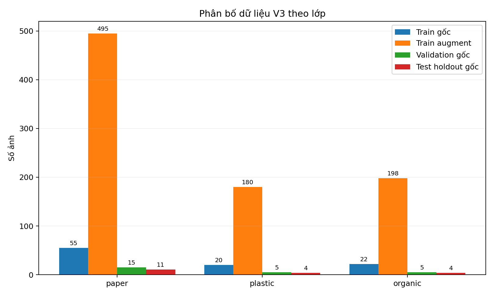
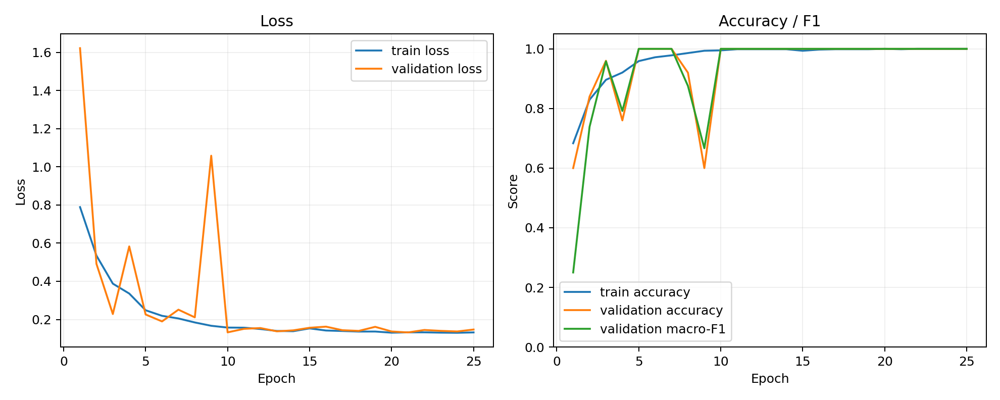
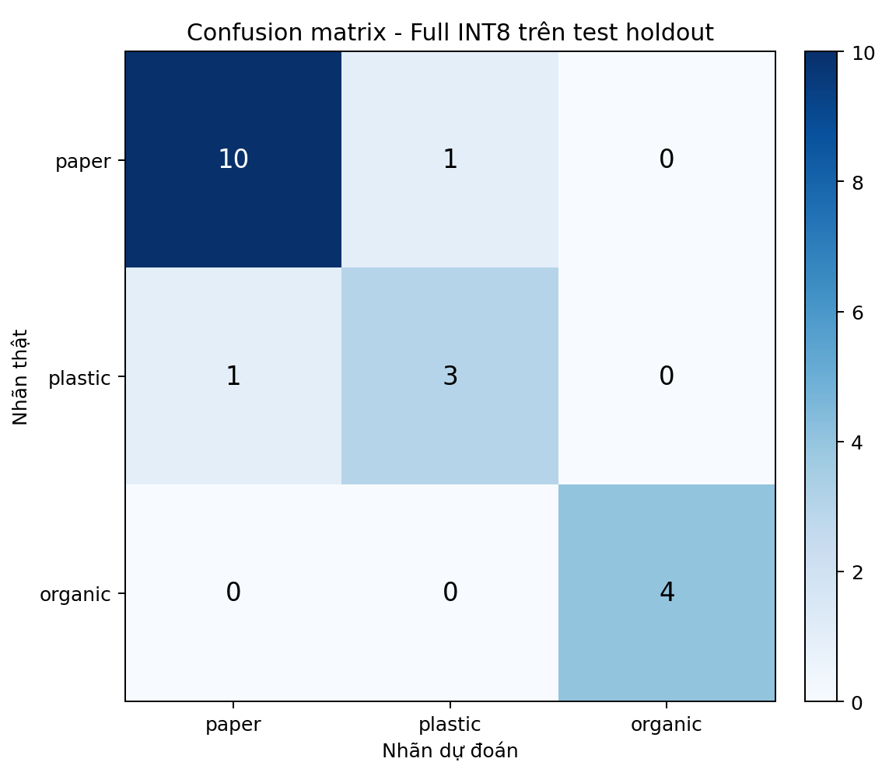

# Báo cáo huấn luyện và đánh giá model V3

## Tóm tắt

- Model: TinyCNN V3, đầu vào `96x96x3`, đầu ra 3 logits theo thứ tự `paper`, `plastic`, `organic`.
- Dữ liệu nguồn: `AI/DATASET`; tổng **97 ảnh train gốc**, **873 ảnh augment** và **25 ảnh validation gốc**.
- Test độc lập là holdout theo nhóm ảnh gốc: **19 ảnh**. Mọi biến thể augment của ảnh test đều bị loại khỏi train.
- Full INT8 trên test: accuracy **89.47%**, balanced accuracy **88.64%**, macro-F1 **88.64%**.
- Quality gate triển khai: **FAIL**. Gate chưa đạt: `accuracy_drop, agreement, class_recall`.



## Phân bố và cách chia dữ liệu

| Lớp | Train gốc nguồn | Ảnh augment nguồn | Train gốc đã dùng | Tổng prepared train | Validation gốc | Test holdout gốc |
|---|---:|---:|---:|---:|---:|---:|
| paper | 55 | 495 | 44 | 440 | 15 | 11 |
| plastic | 20 | 180 | 16 | 160 | 5 | 4 |
| organic | 22 | 198 | 18 | 180 | 5 | 4 |

`validation` được dùng để chọn checkpoint nên không được gọi là test. `test` được tách từ ảnh train gốc với seed `42`; ảnh gốc và các bản augment luôn ở cùng một phía để chống rò rỉ dữ liệu.

## Quá trình huấn luyện

- So với V2, V3 tăng độ rộng/sâu từ 4 lên 5 block convolution (53,387 tham số) và dùng class-weight nghịch đảo tần suất đầy đủ (`paper` 0.591, `plastic` 1.625, `organic` 1.444) để giảm ảnh hưởng của mất cân bằng dữ liệu.
- Không so sánh trực tiếp phần trăm V2 và V3 như cùng một benchmark: V3 được train sau khi `AI/DATASET` tăng từ 61 lên 97 ảnh train gốc và holdout cũng đã thay đổi.
- Tham số model: **53,387**.
- Epoch tốt nhất / epoch đã chạy: **5 / 25**.
- Thời gian train: **33.44 giây** trên môi trường hiện tại.
- Validation tại checkpoint tốt nhất: accuracy **100.00%**, macro-F1 **100.00%**.



## Kết quả eval và test

| Model | Accuracy | Balanced accuracy | Macro-F1 |
|---|---:|---:|---:|
| Float Keras | 94.74% | 91.67% | 93.79% |
| Full INT8 TFLite | 89.47% | 88.64% | 88.64% |

### Chỉ số từng lớp của model INT8

| Lớp | Precision | Recall | F1 | Support |
|---|---:|---:|---:|---:|
| paper | 90.91% | 90.91% | 90.91% | 11 |
| plastic | 75.00% | 75.00% | 75.00% | 4 |
| organic | 100.00% | 100.00% | 100.00% | 4 |

### Confusion matrix

Hàng là nhãn thật, cột là nhãn dự đoán; thứ tự `paper, plastic, organic`.

```text
[10, 1, 0]
[1, 3, 0]
[0, 0, 4]
```



## Kiểm tra lượng tử hóa và artefact

- Float → INT8 agreement: **94.74%**.
- Float model: `286,196 byte (279.49 KiB)`.
- INT8 model: **`62,496 byte (61.03 KiB)`**, full integer = `true`.
- INT8 input: `int8` `[1, 96, 96, 3]`, scale `0.003921568859368563`, zero point `-128`.
- TFLite operators: `CONV_2D, FULLY_CONNECTED, MEAN`.
- SHA-256 INT8: `5e543adfcd64a5627015e0e770fa8b1638d1febaefea2f105fb383707019826a`.
- Số liệu máy đọc được nằm trong `artifacts/training_metrics.json`, `metrics_float.json`, `metrics_int8.json`, `comparison.json`; confusion matrix dạng bảng nằm ở `artifacts/confusion_matrix_int8.csv`.

## Giới hạn

Test holdout chỉ có 19 ảnh gốc và nhiều ảnh có thể được chụp liên tiếp trong cùng bối cảnh. Vì vậy kết quả này phù hợp để so sánh V2/V3 và kiểm tra pipeline, nhưng chưa thay thế một test set thực địa hoàn toàn mới. Nên thu thêm ảnh plastic và organic đa dạng về vật thể, góc, ánh sáng và nền; giữ riêng tập đó cho lần đánh giá cuối.
