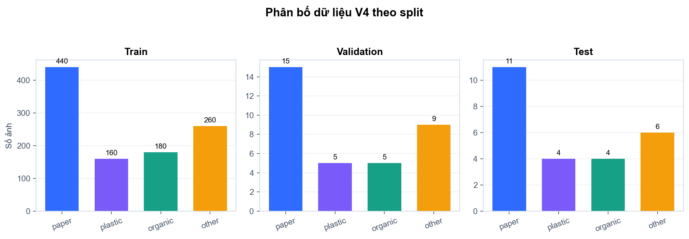
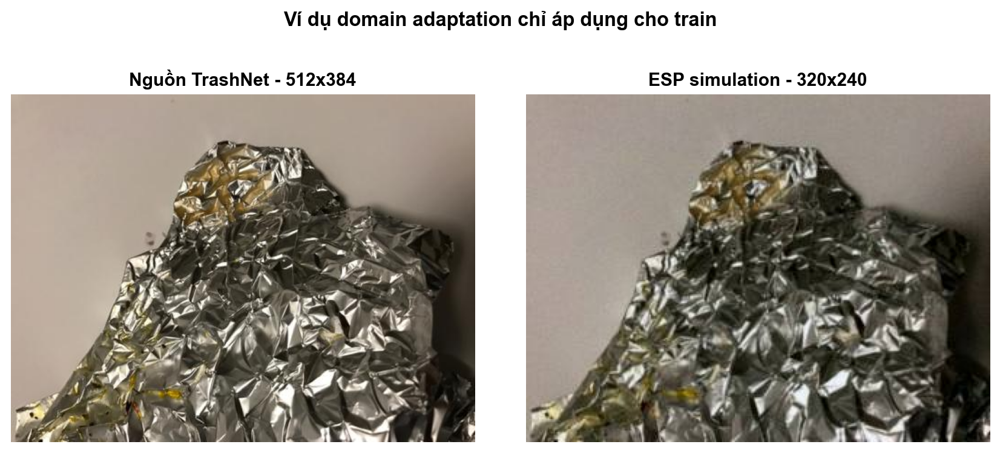
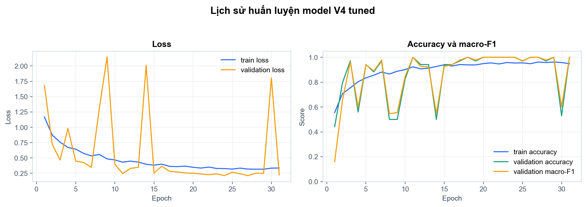
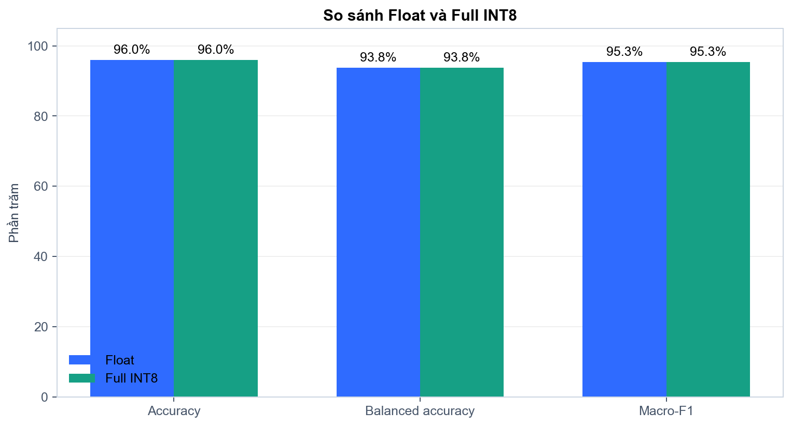
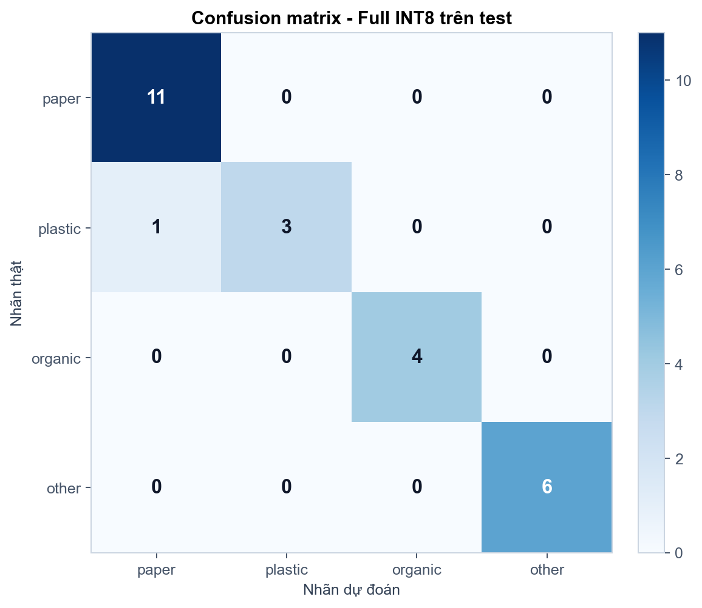

# Báo cáo huấn luyện, đánh giá và triển khai model V4

## Kết luận

- Model: `tinycnn-v4-4class`, đầu vào `96x96x3`, đầu ra bốn logits theo thứ tự `paper`, `plastic`, `organic`, `other`.
- Full INT8 test accuracy: **96.00%**; macro-F1: **95.34%**.
- Float/INT8 agreement: **100.00%**; accuracy drop: **0.00%**.
- Quality gate: **PASS**. Firmware clean-build: **PASS**.
- `other` được map sang UART `C 0`, không mở ngăn paper/plastic/organic.

## Dữ liệu

| Lớp | Train | Validation | Test |
|---|---:|---:|---:|
| paper | 440 | 15 | 11 |
| plastic | 160 | 5 | 4 |
| organic | 180 | 5 | 4 |
| other | 260 | 9 | 6 |

- `other` train = 260, đúng bằng trung bình của ba lớp train V3; gồm 130 cardboard và 130 metal.
- 65/260 ảnh `other` train được mô phỏng QVGA RGB565; validation và test không bị làm xấu.
- Split V3 được giữ nguyên; mỗi ảnh nguồn TrashNet chỉ thuộc một split.

## Huấn luyện và tinh chỉnh

- Kiến trúc V3 được giữ: năm block Conv2D-BatchNorm-ReLU6, GlobalAveragePooling và Dense head; chỉ đổi head từ 3 sang 4 lớp.
- Tham số: **53,452**; best epoch: **11**; epoch đã chạy: **31**.
- Class weight cuối: `{"0": 0.6795454545454546, "1": 1.86875, "2": 1.4444444444444444, "3": 1.0}`. Paper và plastic được nhân 1.15 sau khi baseline INT8 làm lật một mẫu paper sang other.

## Đánh giá Full INT8

| Lớp | Precision | Recall | F1 | Support |
|---|---:|---:|---:|---:|
| paper | 91.67% | 100.00% | 95.65% | 11 |
| plastic | 100.00% | 75.00% | 85.71% | 4 |
| organic | 100.00% | 100.00% | 100.00% | 4 |
| other | 100.00% | 100.00% | 100.00% | 6 |

## Quantization và firmware

- INT8 model: **62,600 byte (61.13 KiB)**, SHA-256 `64df4971dc9b208b2400b8bbc1a608a55164e3342d22ac178b4dc2bb9d0a06f2`.
- Input: `[1, 96, 96, 3]`, `int8`, scale `0.003921568859368563`, zero point `-128`.
- Output: `[1, 4]`, `int8`, scale `0.05950229614973068`, zero point `-27`.
- TFLM operators: `CONV_2D, FULLY_CONNECTED, MEAN`; float tensor còn lại: `0`.
- Firmware app binary: `1,428,624 byte (1395.14 KiB)`; merged SHA-256 `5de21e0cc0d416894d220ede967b40be9ec07810014782e6f46cae68d7cbab81`.

## Giới hạn

Test chỉ có 25 ảnh, trong đó plastic có 4 ảnh và other có 6 ảnh. Cardboard trong TrashNet có thể chồng lấn ngữ nghĩa với một số mẫu paper màu nâu; cần thu thêm test thực địa từ camera ESP32-CAM. Clean-build và self-test tham chiếu đã được kiểm tra, nhưng báo cáo này không thay thế thử nghiệm trên bo mạch vật lý.
