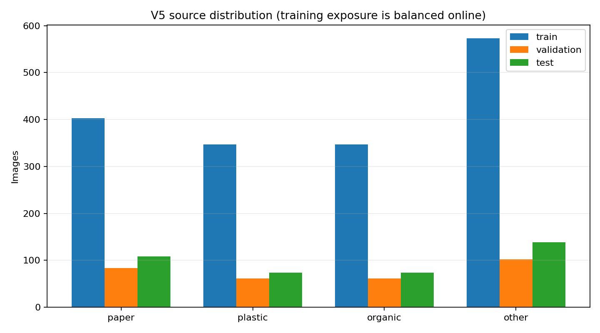
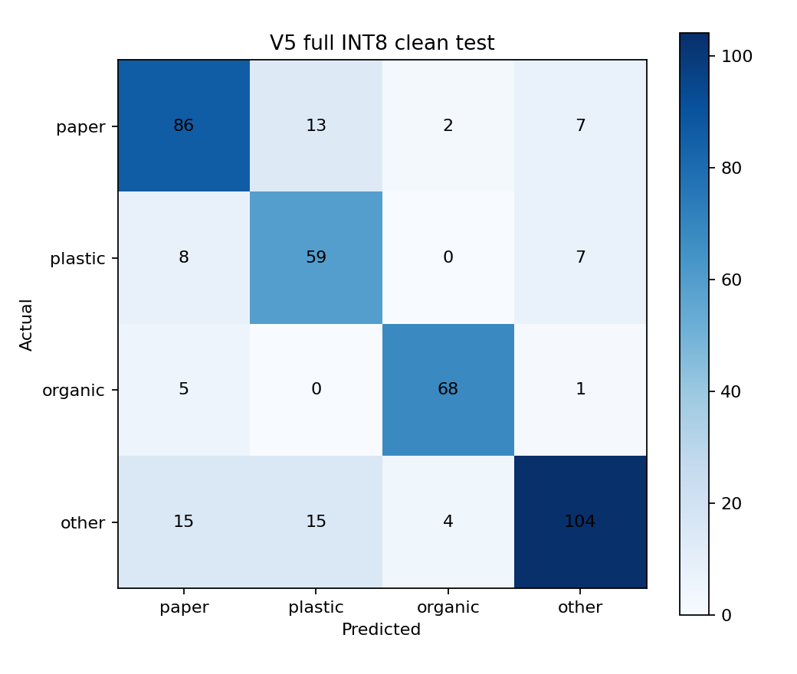
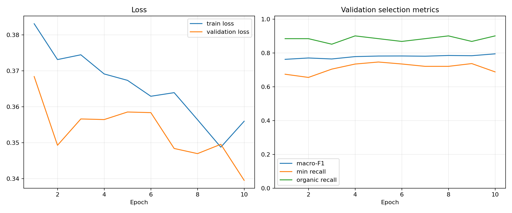
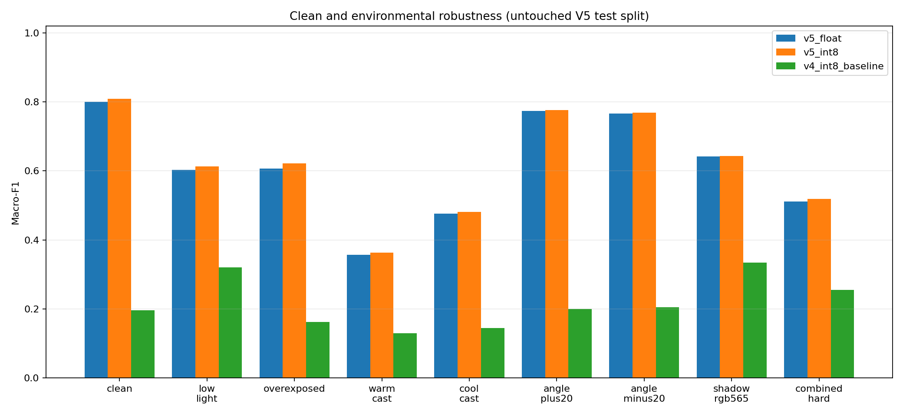

# Báo cáo huấn luyện và triển khai model V5

## Kết luận

- Model: `tinycnn-v5-env-balanced`, đầu vào `96x96x3`, nhãn `paper, plastic, organic, other`.
- Clean INT8 test: accuracy **80.46%**, macro-F1 **80.90%** trên **394** ảnh độc lập.
- Lỗi mục tiêu `organic → paper`: **5/74 (6.76%)**.
- Trung bình 8 profile môi trường: macro-F1 **59.81%**, organic recall **84.46%**.
- Float/INT8 agreement **97.46%**; deployment gate: **PASS**; environment gate: **FAIL**.
- Cùng clean test này, V4 baseline: accuracy **37.06%**, macro-F1 **19.57%**.

## Dữ liệu và cân bằng

| Lớp | Train gốc | Validation sạch | Test sạch | Mẫu hiệu dụng mỗi epoch |
|---|---:|---:|---:|---:|
| paper | 403 | 83 | 108 | 573 |
| plastic | 347 | 61 | 74 | 573 |
| organic | 347 | 61 | 74 | 573 |
| other | 573 | 102 | 138 | 573 |

- Sampling round-robin cho bốn lớp nên mỗi batch/epoch có đóng góp lớp bằng nhau; không dùng class-weight chồng lên oversampling.
- Chỉ train được augment: góc ±25°, scale/translation/shear, gamma và phơi sáng, tương phản/màu/white balance, bóng đổ, blur/noise, giảm độ phân giải và RGB565.
- Validation/test không augment và giữ nguyên split nguồn; mọi biến thể stress được báo riêng, không trộn vào clean accuracy.

## Kết quả clean INT8

| Lớp | Precision | Recall | F1 | Support |
|---|---:|---:|---:|---:|
| paper | 75.44% | 79.63% | 77.48% | 108 |
| plastic | 67.82% | 79.73% | 73.29% | 74 |
| organic | 91.89% | 91.89% | 91.89% | 74 |
| other | 87.39% | 75.36% | 80.93% | 138 |

## Độ bền điều kiện môi trường

| Profile | Accuracy | Macro-F1 | Organic recall | Organic → paper |
|---|---:|---:|---:|---:|
| clean | 80.46% | 80.90% | 91.89% | 6.76% |
| low_light | 62.94% | 61.30% | 70.27% | 10.81% |
| overexposed | 62.18% | 62.15% | 91.89% | 8.11% |
| warm_cast | 50.25% | 36.29% | 94.59% | 0.00% |
| cool_cast | 51.02% | 48.14% | 79.73% | 1.35% |
| angle_plus20 | 77.16% | 77.64% | 89.19% | 8.11% |
| angle_minus20 | 76.40% | 76.82% | 91.89% | 6.76% |
| shadow_rgb565 | 64.47% | 64.27% | 72.97% | 12.16% |
| combined_hard | 52.54% | 51.84% | 85.14% | 5.41% |

## INT8 và ESP32

- Model: **62,776 byte**, SHA-256 `08c17480e04782a655ad9d9241b367dc63d677f42e439601f25a9b7d4888877e`.
- Input: `[1, 96, 96, 3]` `int8`, scale `0.003921568859368563`, zero point `-128`.
- Output: `[1, 4]` `int8`, scale `0.041392892599105835`, zero point `14`.
- Operators: `CONV_2D, FULLY_CONNECTED, MEAN`; float tensors còn lại: `0`.
- Tiền xử lý firmware không đổi: QVGA RGB565 → center crop → floor nearest-neighbor 96×96 → `q = pixel - 128`.

- Firmware clean-build: **PASS**; merged image **4,194,304 byte**, SHA-256 `6a250d59701db629123dc27721ae47cb998a8add114a46a6887924239462d49a`.

## Giới hạn

Các profile môi trường là biến đổi xác định từ test sạch nên đo độ nhạy tương đối, không thay thế ảnh mới chụp trực tiếp từ ESP32-CAM. Sau khi nạp firmware cần thu thêm ảnh thực địa theo từng loại ánh sáng/góc, giữ riêng khỏi train, rồi chạy lại audit. Lớp `other` hiện gồm cardboard và metal; các loại rác ngoài hai nhóm này vẫn cần dữ liệu bổ sung.
